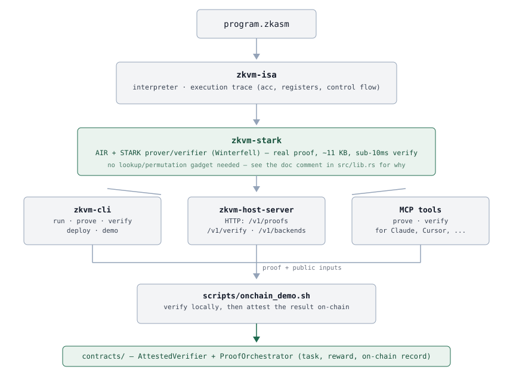

# zkVM (Phase 1 MVP)

[](https://github.com/CodesbyFebin/Zkvm-Hosting/actions/workflows/zk-ci.yml)
[](LICENSE)

A small, real zero-knowledge virtual machine: an interpreter, a STARK arithmetization
(AIR), and a prover/verifier built on [Winterfell](https://github.com/facebook/winterfell).
It executes `ADD`/`SUB`/`MUL` programs with real conditional control flow (`JZ`/`JNZ`)
and a small fixed register file (`LOAD`/`STORE`), and produces a STARK proof that a
specific program — including which branch it took and which register it touched — was
executed correctly.

See [`docs/ROADMAP.md`](docs/ROADMAP.md) for what this does and — just as importantly —
does not cover yet, and how it relates to the larger multi-phase strategy it grew out of.



## Layout

- [`crates/zkvm-isa`](crates/zkvm-isa) — the VM: instruction set, interpreter, `.zkasm` parser.
- [`crates/zkvm-stark`](crates/zkvm-stark) — the AIR, prover, and verifier.
- [`crates/zkvm-cli`](crates/zkvm-cli) — the `zkvm` command-line tool (`run`, `prove`,
  `verify`, `deploy`, `demo`).
- [`crates/zkvm-host-server`](crates/zkvm-host-server) — an HTTP proving service:
  `POST /v1/proofs` to push a program and get a proof back, `POST /v1/verify` to
  check one, plus a `ProverBackend`-trait-based `/v1/backends*` surface for routing
  to more than one prover (today: the real `stark` backend and an honestly-labeled
  `mock-echo` stub). Also exposes `prove`/`verify` as real MCP tools (port 4478) for
  MCP clients like Claude or Cursor. See [`docs/HOST_SERVICE.md`](docs/HOST_SERVICE.md)
  for exactly how this relates (and doesn't) to the larger "zkvm.host" pitch it's
  named after — including a from-first-principles investigation of what a real SP1
  backend would actually take.
- [`contracts/`](contracts) — a Foundry project: an on-chain task/reward orchestrator
  with a pluggable, honestly-scoped proof verifier (see
  [`docs/ONCHAIN_VERIFIER.md`](docs/ONCHAIN_VERIFIER.md) for what a *real* on-chain
  STARK verifier would additionally require).
- [`scripts/onchain_demo.sh`](scripts/onchain_demo.sh) — wires the two together: a
  real proof from the real server gets attested and paid out on a local chain,
  end to end.
- [`.github/workflows/zk-ci.yml`](.github/workflows/zk-ci.yml) — "proof as a CI
  check": every PR touching the VM, server, CLI, or contracts builds, tests, then
  deploys and verifies every example program against a live server.
- [`docs/MCP.md`](docs/MCP.md) — connect Claude Desktop, Cursor, or any MCP client
  straight to the prover; [`docs/THREAT_MODEL.md`](docs/THREAT_MODEL.md) — what's
  trustless here (the proof) versus what isn't yet (the on-chain payment);
  [`docs/RECURSION.md`](docs/RECURSION.md) — a literature-review scope (not an
  implementation) of what making the on-chain path trustless would actually require.
- [`examples/`](examples) — sample `.zkasm` programs, including
  [`branching.zkasm`](examples/branching.zkasm) and [`counter.zkasm`](examples/counter.zkasm).

## Quick start

```bash
cargo build --release
cargo test --release --workspace
```

Use `--release` for tests, not just binaries: one of `zkvm-stark`'s constraints has a
data-dependent polynomial degree (see the comment in `evaluate_transition`), which
trips a Winterfell debug-only self-check that's stricter than actual soundness
requires. `--release` compiles that check out; it isn't hiding a real bug (all the
same tests pass either way once that specific assertion is skipped) — see the code
comment for the full explanation.

```bash
# run the full execute -> prove -> verify -> tamper-check demo
cargo run --release -p zkvm-cli -- demo

# or drive it by hand
cargo run --release -p zkvm-cli -- run    examples/fibonacci_like.zkasm
cargo run --release -p zkvm-cli -- prove  examples/fibonacci_like.zkasm out.proof
cargo run --release -p zkvm-cli -- verify examples/fibonacci_like.zkasm out.proof

# a program whose result depends on runtime control flow, not just arithmetic
cargo run --release -p zkvm-cli -- run examples/branching.zkasm

# a program that holds a value in a register across unrelated arithmetic
cargo run --release -p zkvm-cli -- run examples/counter.zkasm

# or "push code, get a proof" over HTTP instead of proving locally
cargo run --release -p zkvm-host-server &           # listens on :4477
cargo run --release -p zkvm-cli -- deploy examples/fibonacci_like.zkasm
cargo run --release -p zkvm-cli -- verify examples/fibonacci_like.zkasm examples/fibonacci_like.zkasm.proof

# and the on-chain orchestrator (Foundry)
cd contracts && forge test

# or the full loop: a real proof, paid out on a local chain
./scripts/onchain_demo.sh

# or talk to it over MCP (see docs/MCP.md)
cargo build --release -p zkvm-host-server && ./scripts/mcp_demo.sh
```

## The `.zkasm` format

```text
INIT 5      # starting accumulator value
ADD 3       # acc = acc + 3
STORE r0    # registers[0] = acc
JZ done     # forward jump to a label, taken if acc == 0
MUL 2       # acc = acc * 2
LOAD r0     # acc = registers[0]
done:
SUB 4       # acc = acc - 4
```

`JZ`/`JNZ` targets are labels, resolved at parse time, and must jump forward only —
see [`docs/ROADMAP.md`](docs/ROADMAP.md) for why loops aren't supported yet.
`LOAD`/`STORE` address one of a small, fixed set of registers (`r0`..`r3`) — scratch
space for holding a second live value across arithmetic, not general-purpose memory
(there's no dynamic addressing yet; see `docs/ROADMAP.md`).

## How the proof actually binds to the program

Each trace row has one row per *static* instruction (never revisited — see above),
holding the accumulator value, the four register values, seven one-hot opcode
selectors (`s_add, s_sub, s_mul, s_jz, s_jnz, s_load, s_store`), the shared
immediate/target/register operand, an `active` flag (did this row actually run, or
was it skipped by an earlier taken jump), and a one-hot `reg_sel` (which register a
`LOAD`/`STORE` addresses).

Every column except the accumulator and the registers — including `active` and
`reg_sel` — is individually asserted (as a boundary constraint) against the specific
program *and its actual execution*, for every row, not just the first and last.
That's sound without an algebraic is-zero/lookup gadget deriving branch outcomes or a
mux selecting a register, specifically because this system has no private witness:
the verifier already re-executes the program to know the correct value for every row
(see the doc comment at the top of `zkvm-stark/src/lib.rs` for the full argument). The
things that *are* checked algebraically, via the AIR's transition constraints, are
whether the accumulator's and each register's trajectory are consistent with that
already-known-correct (opcode, active, reg_sel) sequence.

A prover cannot swap in a different sequence of instructions, a different
control-flow outcome, or a different register access, for the same instructions, and
still produce a proof that verifies. `zkvm-stark`'s test suite checks this directly:
tampering with the claimed result, program, `active` flags, or register selectors
after proof generation causes verification to fail.

## Contributing

Bug reports, `.zkasm` programs that break something, and small honestly-scoped PRs are
welcome — see [`CONTRIBUTING.md`](CONTRIBUTING.md) for setup and the PR checklist.
Found a soundness or security issue? Read [`SECURITY.md`](SECURITY.md) before filing a
public issue. This project follows the [Contributor Covenant](CODE_OF_CONDUCT.md).
See [`CHANGELOG.md`](CHANGELOG.md) for release history.

## Funding

Sponsorship, one-time crypto donations, and a list of real grant programs this
project could reasonably apply to are at [`funding/`](funding) — or use the
"Sponsor" button GitHub shows on this repo.
